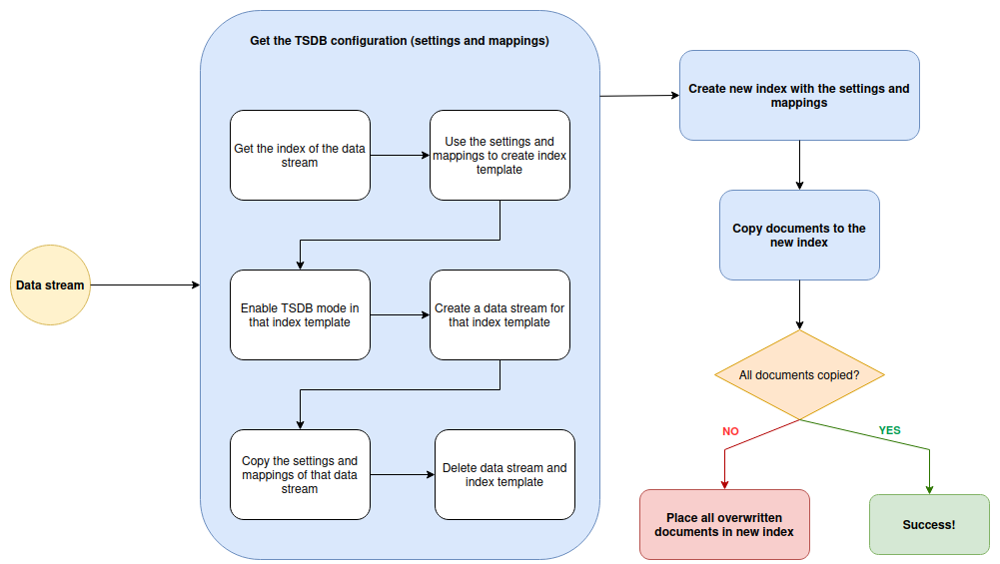
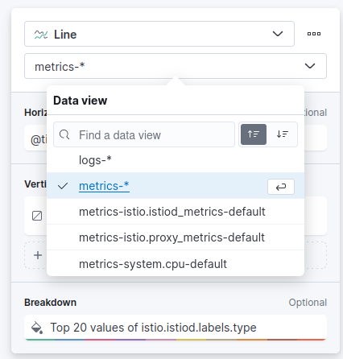

This repository contains the code to a new approach for testing
TSDB migration. In [Why is this important](#Why-is-this-important) you
get a better overview of what this is and why it is necessary.

# Table of Contents
1. [Installation](#Installation)
2. [Requirements](#Requirements)
3. [Set up](#Set-up)
4. [Why is this important](#Why-is-this-important)
5. [Understanding the program](#Understanding-the-program)
6. [Algorithm in detail](#Algorithm-in-detail)
7. [Realistic output example](#Realistic-output-example)
8. [Test cases covered](#Test-cases-covered)
9. [Cons of this approach (and why they are not important)](#Cons-of-this-approach-(and-why-they-are-not-important))

## Installation

You need to install the [Python client for ElasticSearch](https://www.elastic.co/guide/en/elasticsearch/client/python-api/current/installation.html):
```console
python -m pip install elasticsearch
```

## Requirements

1. You need to be running ElasticSearch.
2. You need a data stream with at least one field set as dimension.


## Set up

You need to set the variables in the `main.py` file:

```python
# Variables to configure the ES client
elasticsearch_host = "https://localhost:9200"
elasticsearch_ca_path = "/home/c/.elastic-package/profiles/default/certs/elasticsearch/ca-cert.pem"
elasticsearch_user = "elastic"
elasticsearch_pwd = "changeme"

# There NEEDS to be fields with time_series_dimension: true.
data_stream = "metrics-docker.cpu-default"
```

The program should be ready to run after.

## Why is this important

Currently, the testing for TSDB migration is all done manually.
The steps for this testing process can be found in [this document](https://docs.google.com/document/d/1l-PCY9zHQ0TTyQuCSbf5qKUvxV7lpfMybY0APMJweRI/edit#heading=h.qrq8p339p7it).

There are a few drawbacks to this testing process:
1. If we receive documents in an inconsistent manner (like it happens with GCP integration) then we cannot see if we
lose information or not when TSDB is enabled.
2. If we receive lots of documents, it is very hard to find which ones were lost. We have to do that manually.
3. If we want to create situations that cause a conflict to check if TSDB is working correctly, we need to do it twice: one for TSDB disabled and one for TSDB enabled.
4. If waiting to test for an index for 1 hour for each mode, then we would have to do the exact same thing twice:
once for when TSDB is disabled, and once for when TSDB is enabled, each mode for 1 hour.


This makes the testing process very vulnerable (and tiring).

This approach tries to fix all those vulnerabilities in a way that the only thing
the tester needs to do is give as an input the `data_stream` name with TSDB disabled.
After that, the program will tell the tester if the dimensions set are enough or not.


## Understanding the program

Before reading anything else from this page,
please refer to the [sample](sample/README.md) to understand the basics of it.


## Algorithm in detail

> **Note**: The overview of the algorithm can be found in [sample](sample/README.md). This section
> will be go in more depth of what is actually is happening. Please, make sure you
> understand the sample.

The flow goes like this:




1. First, we need the data stream with TSDB **disabled**. Even though this data stream has TSDB disabled,
**it is necessary that dimensions are set**.
2. After that, we need the settings and mappings so we can create a new index
with TSDB enabled. This means that our settings and mappinhs have these
**requirements**: 1) the index mode is `time_series`; 2) we have dimension fields
in the mappings; 3) the `routing_path` includes all these dimensions. To get all of this:
    1. We get the index of that data stream. We need to do this, because we cannot obtain
   the mappings and settings through the data stream, only through an index.
   2. We use the settings and mappings to create a new index template. We need the index template
   so we can obtain the `routing_path` easily by setting the requirement `"allow_custom_routing": "false"`.
   3. We create a new data stream that matches the index template. We need this because
   the index template does not have the `routing_path` set (reason unknown).
   4. We copy the settings and mappings and return them. These settings and mappings
   have all the requirements to create the new TSDB index.
   5. We delete this data stream and index template. It is easier to use an index because
   a data stream will cause problems when trying to reindex (more on this can be found
      [here](https://www.elastic.co/guide/en/elasticsearch/reference/current/docs-reindex.html)).
3. Now that we have the settings and mappinggs, we **create an empty index** with that configuration.
4. We **reindex** - this means that we copy - all documents from our original data stream to our newly
create TSDB index.
5. We check if the number of documents is the same.
   6. _Is it the same?_ There was no loss of data.
   7. _Is it not the same?_ All documents that were overwritten will be put in a new index and the dimensions
   used to identify them will be displayed. We need to place these overwritten documents
   in a new index because the field `_version` is not searchable, so this is the workaround.

## Realistic output example

<details>
<summary>
In case TSDB migration was successful, ie, no loss of data occurred.
</summary>

```console
You're testing with version 8.8.0-SNAPSHOT.

Using data stream metrics-istio.istiod_metrics-default to create new TSDB index tsdb-index-enabled...
	The index .ds-metrics-istio.istiod_metrics-default-2023.06.13-000001 will be used as the standard index.
Creating index tsdb-index-enabled...
	Index tsdb-index-enabled exists and will be deleted.
Index tsdb-index-enabled successfully created.

Copying documents from .ds-metrics-istio.istiod_metrics-default-2023.06.13-000001 to tsdb-index-enabled...
All 5000 documents taken from index .ds-metrics-istio.istiod_metrics-default-2023.06.13-000001 were successfully placed to index tsdb-index-enabled.
```
</details>

<details>
<summary>
In case TSDB migration was not successful.
</summary>

```console
You're testing with version 8.8.0-SNAPSHOT.

Using data stream metrics-istio.istiod_metrics-default to create new TSDB index tsdb-index-enabled...
	The index .ds-metrics-istio.istiod_metrics-default-2023.06.13-000001 will be used as the standard index.
Creating index tsdb-index-enabled...
	Index tsdb-index-enabled exists and will be deleted.
Index tsdb-index-enabled successfully created.

Copying documents from .ds-metrics-istio.istiod_metrics-default-2023.06.13-000001 to tsdb-index-enabled...
WARNING: Out of 38829 documents from the index .ds-metrics-istio.istiod_metrics-default-2023.06.13-000001, 3242 of them was/were discarded.

Index for the overwritten documents will be created...
Creating index tsdb-overwritten-docs...
	Index tsdb-overwritten-docs exists and will be deleted.
Index tsdb-overwritten-docs successfully created.

The timestamp and dimensions of the first 10 overwritten documents are:
- Timestamp 2023-06-13T07:25:32.802Z:
	cloud.instance.id = (Missing value)
	cloud.account.id = (Missing value)
	agent.id = cb72267d-77f7-43b2-a7dc-16c6f325fd14
	cloud.provider = (Missing value)
	service.address = (Missing value)
	host.name = kind-control-plane
	istio.istiod.labels_id = /nvav668p0/1SUGKpp/iqPGeBvQ=
	cloud.availability_zone = (Missing value)
	cloud.region = (Missing value)
- Timestamp 2023-06-13T07:22:42.800Z:
	cloud.instance.id = (Missing value)
	cloud.account.id = (Missing value)
	agent.id = cb72267d-77f7-43b2-a7dc-16c6f325fd14
	cloud.provider = (Missing value)
	service.address = (Missing value)
	host.name = kind-control-plane
	istio.istiod.labels_id = /nvav668p0/1SUGKpp/iqPGeBvQ=
	cloud.availability_zone = (Missing value)
	cloud.region = (Missing value)
- Timestamp 2023-06-13T07:25:32.802Z:
	cloud.instance.id = (Missing value)
	cloud.account.id = (Missing value)
	agent.id = cb72267d-77f7-43b2-a7dc-16c6f325fd14
	cloud.provider = (Missing value)
	service.address = (Missing value)
	host.name = kind-control-plane
	istio.istiod.labels_id = 0sgWJXQUzSyPqp+dUA14QEXdSUU=
	cloud.availability_zone = (Missing value)
	cloud.region = (Missing value)
- Timestamp 2023-06-13T07:22:42.800Z:
	cloud.instance.id = (Missing value)
	cloud.account.id = (Missing value)
	agent.id = cb72267d-77f7-43b2-a7dc-16c6f325fd14
	cloud.provider = (Missing value)
	service.address = (Missing value)
	host.name = kind-control-plane
	istio.istiod.labels_id = 0sgWJXQUzSyPqp+dUA14QEXdSUU=
	cloud.availability_zone = (Missing value)
	cloud.region = (Missing value)
- Timestamp 2023-06-13T07:25:32.802Z:
	cloud.instance.id = (Missing value)
	cloud.account.id = (Missing value)
	agent.id = cb72267d-77f7-43b2-a7dc-16c6f325fd14
	cloud.provider = (Missing value)
	service.address = (Missing value)
	host.name = kind-control-plane
	istio.istiod.labels_id = 223lD4Lr2QfSW+uxD8GSnuPFj6w=
	cloud.availability_zone = (Missing value)
	cloud.region = (Missing value)
- Timestamp 2023-06-13T07:22:42.800Z:
	cloud.instance.id = (Missing value)
	cloud.account.id = (Missing value)
	agent.id = cb72267d-77f7-43b2-a7dc-16c6f325fd14
	cloud.provider = (Missing value)
	service.address = (Missing value)
	host.name = kind-control-plane
	istio.istiod.labels_id = 223lD4Lr2QfSW+uxD8GSnuPFj6w=
	cloud.availability_zone = (Missing value)
	cloud.region = (Missing value)
- Timestamp 2023-06-13T07:25:32.802Z:
	cloud.instance.id = (Missing value)
	cloud.account.id = (Missing value)
	agent.id = cb72267d-77f7-43b2-a7dc-16c6f325fd14
	cloud.provider = (Missing value)
	service.address = (Missing value)
	host.name = kind-control-plane
	istio.istiod.labels_id = 35M5nmhaXoUHJb/68k4pxv4qq4w=
	cloud.availability_zone = (Missing value)
	cloud.region = (Missing value)
- Timestamp 2023-06-13T07:22:42.800Z:
	cloud.instance.id = (Missing value)
	cloud.account.id = (Missing value)
	agent.id = cb72267d-77f7-43b2-a7dc-16c6f325fd14
	cloud.provider = (Missing value)
	service.address = (Missing value)
	host.name = kind-control-plane
	istio.istiod.labels_id = 35M5nmhaXoUHJb/68k4pxv4qq4w=
	cloud.availability_zone = (Missing value)
	cloud.region = (Missing value)
- Timestamp 2023-06-13T07:25:32.802Z:
	cloud.instance.id = (Missing value)
	cloud.account.id = (Missing value)
	agent.id = cb72267d-77f7-43b2-a7dc-16c6f325fd14
	cloud.provider = (Missing value)
	service.address = (Missing value)
	host.name = kind-control-plane
	istio.istiod.labels_id = 4b92gpIKHf9qEv5gUdt/C7ZYe78=
	cloud.availability_zone = (Missing value)
	cloud.region = (Missing value)
- Timestamp 2023-06-13T07:22:42.800Z:
	cloud.instance.id = (Missing value)
	cloud.account.id = (Missing value)
	agent.id = cb72267d-77f7-43b2-a7dc-16c6f325fd14
	cloud.provider = (Missing value)
	service.address = (Missing value)
	host.name = kind-control-plane
	istio.istiod.labels_id = 4b92gpIKHf9qEv5gUdt/C7ZYe78=
	cloud.availability_zone = (Missing value)
	cloud.region = (Missing value)
```

</details>


## Test cases covered

The testing checks we need to do now can be resumed in just two points:

- [x] Check the number of documents is the same for when TSDB is disabled vs enabled
- [ ] Check the dashboard works as expected for both modes.

This approach covers well the first case, but checking the dashboards is still
a process that needs to be done manually (see next section on why I think this
is not an obstacle to adopt this approach).


## Cons of this approach (and why they are not important)

1. We have no easy way to use the data from the index with TSDB disabled for
the dashboards. We would have to go to each visualization and change the data view:


   Why not important: problems regarding the dashboards should all be fixed by now.
If there are still aggregations being used in an incorrect way, that is a process
that will have to be done manually, regarding of TSDB being enabled or not. Otherwise,
fixing the dashboards automatically is a totally different (and needed!) problem
from the TSDB migration.

2. We are following this **TSDB disabled > TSDB enabled** instead of
**TSDB disabled > TSDB enabled > TSDB disabled** and checking if all documents
passed the migrations. I chose to do this because disabling TSDB and checking
that we did not lose any data is a general problem and not something related
to an integration. And just like the dashboards, all problems related to this
should be fixed by now.
